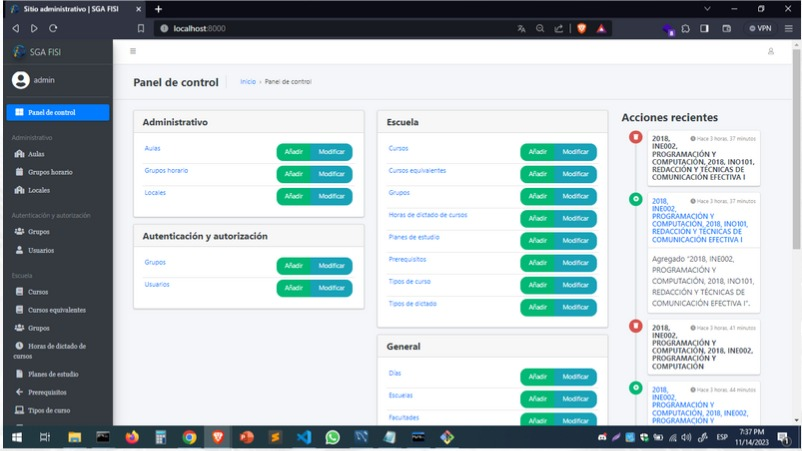

# SGA FISI (Sistema Gestion Administrativo - FISI)
Administrative Management System
## Code Hunters Team
- José Luis La Torre Romero
- Jorge Jesús Quispe Villaverde
## Tools
- Programming Language: Python 3.12
- Framework: Django 4.2.6
- DDBB: MySQL Community Server 8.2.0
## Instalation and Settings
- Install MYSQL
- Install Python
- Create a new virtual enviromment and install all requirements
- Dump DDBB
- Run Django server

